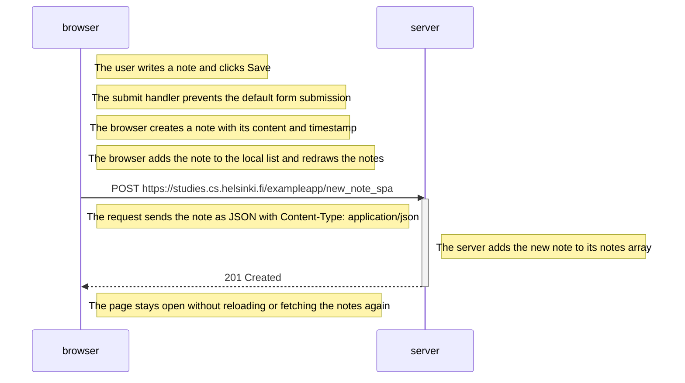

```mermaid
sequenceDiagram
    participant browser
    participant server

    Note right of browser: The user writes a note and clicks Save
    Note right of browser: The submit handler prevents the default form submission
    Note right of browser: The browser creates a note with its content and timestamp
    Note right of browser: The browser adds the note to the local list and redraws the notes

    browser->>server: POST https://studies.cs.helsinki.fi/exampleapp/new_note_spa
    activate server
    Note right of browser: The request sends the note as JSON with Content-Type: application/json
    Note right of server: The server adds the new note to its notes array
    server-->>browser: 201 Created
    deactivate server

    Note right of browser: The page stays open without reloading or fetching the notes again
```
